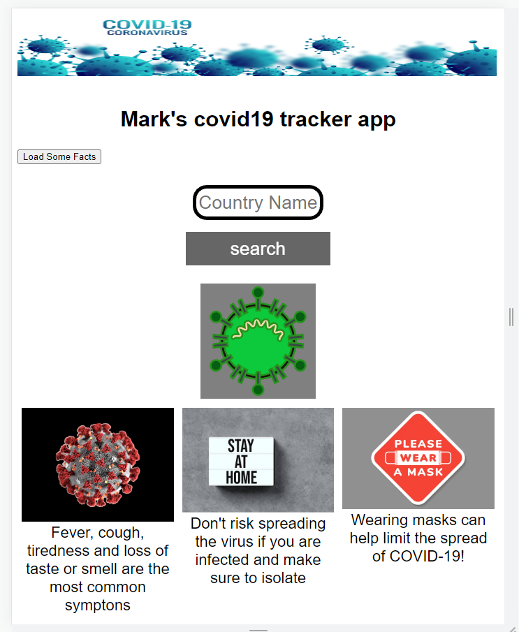
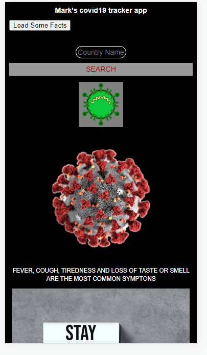

This is the desktop view

A very simple covid19 tracker app which calls the covid19 api to return the number of deaths and recovery from country input.

Type in a country name to find out the numbers.

REQUIREMENTS:
1. clone the files into your local and run it
2. run npm install
3. host on an http server through node.js
4. create a proxy to call by running npm install -g local-cors-proxy
-> this allows you to use the mock api 
5. run lcp --proxyUrl https://marky-covid-api.herokuapp.com/disease